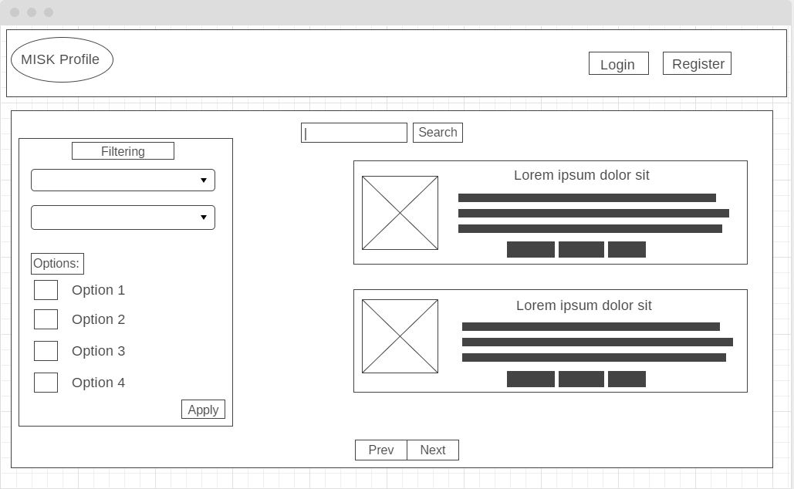
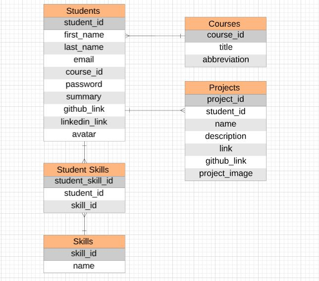

# Misk-Profile

It's a simple web application that provides a platform for MISK Academy dtudents to create their personal profile to showcase their skills and projects and other information about them.
It can be used by recruiters who want to hire MISK graduates to easily look for the perfect candidate.

## User Stories

* As a student, I should be able to create an account with using my eamil and password.
* As a student, I should have execlusive access to editing my profile.
* As a student, I should be able to delete my account.
* As a student, I should be able to add/remove add any of the available skills.
* As an Unregistered User, I should be able to view a list of all students.
* As an Unregistered User, I can filter the list of student based on their skills.
* As an Unregistered User, I can filter the list of student based on their course.
* As an Unregistered User, I should be able to view a select student details.
* As an Admin, I should be able to remove/add courses.
* As an Admin, I should be able to control the data of all students.

## Wireframe

The wireframe for this project can be found [here](https://wireframe.cc/RBetUw)



## ERD

The Entity-Relationship Diagram for this project can found [here](https://www.lucidchart.com/documents/edit/09257c59-2aa1-452d-88a4-8b27caa847de/0_0?shared=true)



## Future Directions

* Improve styling.
* Add interactivity features.

## Instructions to Run

```bash
$ bundle install
```

```bash
$ rails db:create
```

```bash
$ rails db:migrate
```

```bash
$ rails db:seed
```

```bash
$ rails s
```

And lastly open your browser on localhost:3000
